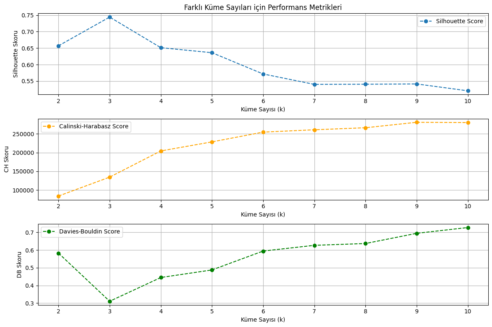
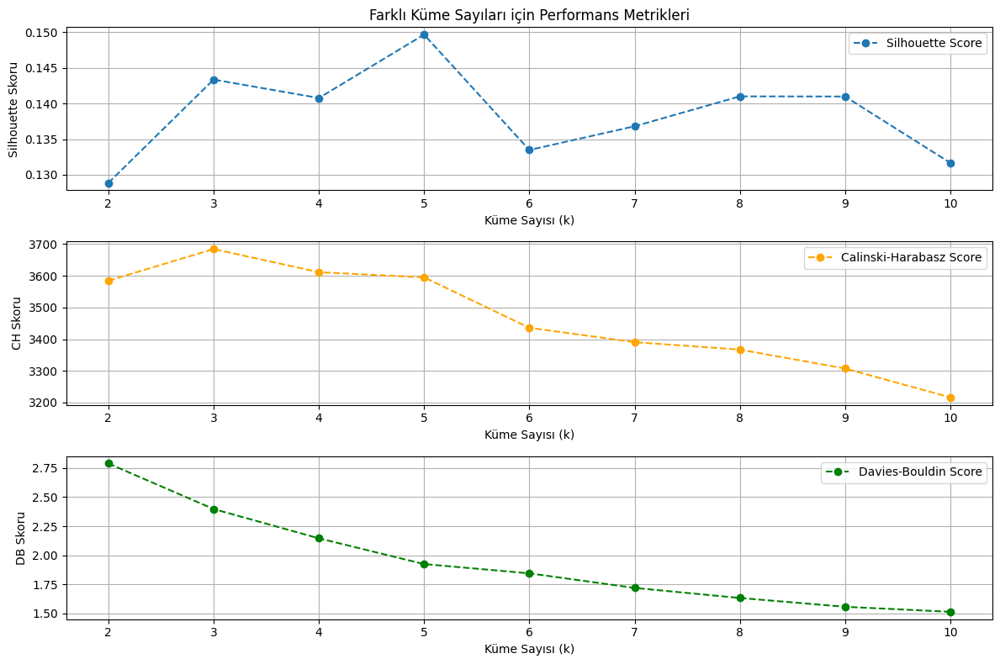
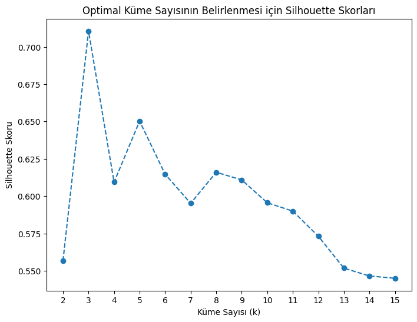
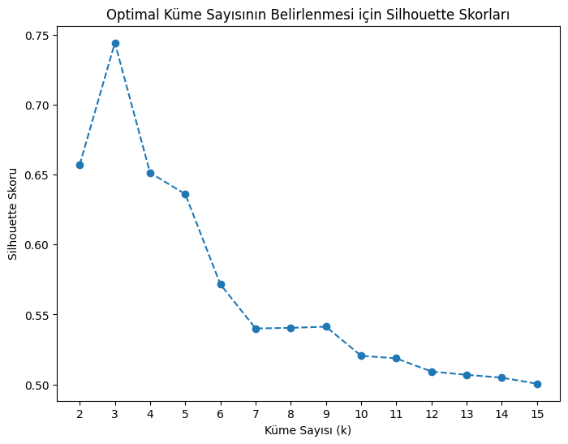

# Restoran Verisi Üzerinde Gözetimsiz ve Gözetimli Öğrenme Modelleri

Bu proje, restoranlarla ilgili geniş bir veri seti kullanılarak iki farklı öğrenme türünün (gözetimsiz ve gözetimli öğrenme) performansını karşılaştırmayı amaçlamaktadır. Veri setinde restoranlar hakkındaki bilgiler (konum, puanlama, çevrimiçi sipariş, mutfak türleri gibi) yer almakta olup, projede gözetimsiz öğrenme ile kümeleme yapılmış, ardından gözetimli öğrenme algoritmaları ile sınıflandırma gerçekleştirilmiştir.

## Veri Seti

- **Veri seti boyutu:** 93MB
- **Veri seti şekli:** (51,717 satır, 17 sütun)
- **Bu veri seti, restoranlarla ilgili çeşitli bilgileri içermekte olup, aşağıdaki sütunları kapsamaktadır:**
  - url: Restoranın url adresi
  - address: Restoran adresi
  - name: Restoran ismi
  - online_order: Online sipariş özelliği (evet/hayır)
  - book_table: Masa rezervasyonu özelliği (evet/hayır)
  - rate: Müşteri oy oranı
  - votes: Oy sayısı
  - phone: Telefon numarası
  - location: Restoranın bulunduğu konum
  - rest_type: Restoran türü
  - dish_liked: En beğenilen yemek
  - cuisines: Mutfak türleri
  - cost: Ortalama maliyet
  - reviews_list: Restoran hakkındaki yorumlar
  - menu_item: Menüdeki ürünler
  - type: Restoranın hizmet tipi (örneğin; casual dining, fine dining)
  - city: Şehir

## Gözetimsiz Öğrenme - Kümelenme

- Kümeleme algoritması ile restoranlar lokasyon bazlı olarak gruplandırılmıştır. K-ortalama (K-Means) algoritması kullanılarak lokasyona göre restoranların benzer özelliklere göre kümelenmesi sağlanmıştır.

- **Kümelenme Sonuçları**
  - Silhouette Skoru: 0.7442
  - Calinski-Harabasz Skoru: 134550.5495
  - Davies-Bouldin Skoru: 0.3108

Sonuç olarak, lokasyon bazlı kümeleme oldukça başarılı olmuş ve restoranlar doğal olarak coğrafi bölgelere göre ayrılmıştır. Kümeler arasında bazı iç içe geçmişlikler olsa da, bu restoranların lokasyon yakınlığına ve benzer özelliklere sahip olmasından kaynaklanmaktadır. Aykırı değer tespiti, boyutsal azaltma ve manuel parametre optimizasyonu yapılmış ve en iyi sonuçlar bu aşamada elde edilmeye çalışılmıştır.

## Gözetimli Öğrenme - Sınıflandırma

- Gözetimli öğrenme aşamasında Decision Tree (Karar Ağacı) ve Random Forest (Rastgele Orman) algoritmaları kullanılmıştır. Amaç, restoranların müşteri puanlamalarıa göre sınıflandırılmasını sağlamaktır.

- **Karar Ağacı Sonuçları**
  - Sınıf 0 (Yüksek Puanlama): Kesinlik %95, Geri Çağırma %95, F1 Skoru %95
  - Sınıf 1 (Orta Puanlama): Kesinlik %98, Geri Çağırma %98, F1 Skoru %98
  - Sınıf 2 (Düşük Puanlama): Kesinlik %88, Geri Çağırma %95, F1 Skoru %91

  Bu sonuçlara göre, karar ağacı modelinin genel performansı yüksek olsa da sınıf 2 için kesinlik biraz daha düşük kalmıştır. Bu durum, modelin düşük oy alan restoranları diğerlerinden ayırt etmede zorluk yaşadığını gösteriyor.

- **Rastgele Orman Sonuçları**
  - Sınıf 0 (Yüksek Puanlama): Kesinlik %98, Geri Çağırma %96, F1 Skoru %97
  - Sınıf 1 (Orta Puanlama): Kesinlik %98, Geri Çağırma %99, F1 Skoru %99
  - Sınıf 2 (Düşük Puanlama): Kesinlik %100, Geri Çağırma %87, F1 Skoru %93

  Rastgele Orman modelinde ise sınıf 2 (düşük puanlama) için geri çağırma oranı biraz daha düşük olsa da genel olarak modelin performansı mükemmel seviyededir. Rastgele ormanlar, karar ağaçlarının güçlü yönlerini bir araya getirerek aşırı öğrenmeyi engeller ve daha güvenilir sonuçlar sunar. Bu nedenle, modelin son aşamada tercih edilen yöntemi Random Forest olmuştur.

  ## Model Performansı ve Karşılaştırma
  - **TSNE YÖNTEMİ KULLANILARAK ELDE EDİLEN KÜMELEME BAŞARISI**
  
- **PCA YÖNTEMİ KULLANILARAK ELDE EDİLEN KÜMELEME BAŞARISI**
  

  - **EKSİK DEĞERLER İÇİN MODE-MEDİAN-MEAN YÖNTEMİ SILHOUETTE BAŞARISI**
  
  - **EKSİK DEĞERLER İÇİN DROPNA YÖNTEMİ SILHOUETTE BAŞARISI**
  
  
  

## Model Performansı ve Yorum
İki öğrenme türü karşılaştırıldığında, her iki yöntemin de veri setine göre oldukça iyi sonuçlar verdiği görülmüştür. Ancak şu yorumlar yapılabilir:

- **Gözetimsiz öğrenme için;** 
Etiketlenmemiş veriler üzerinde benzer veri noktalarını gruplandırmak için kullanılır. Bu projede, restoranların lokasyon, restoran türü, mutfak çeşitleri gibi özellikler gözetimsiz öğrenme için uygun verilerdir. Bu veriler, restoranların belirgin gruplara ayrılmasına yardımcı olabilir. Özellikle K-Means algoritması, restoranları konum bazlı ve bazı benzer özelliklere göre kümelere ayırmak için etkili bir yöntemdir. Ancak, gözetimsiz öğrenmenin doğal bir sınırlaması bulunur: verilerin kategorilere ayrılmasında bazı iç içe geçmişlikler meydana gelebilir. Bu projede de kümeler arasında benzer lokasyondaki restoranların bazı özelliklerde örtüşmesi gözlemlenmiştir. Bunun nedeni, restoranların benzer coğrafi bölgelerde yer alması ve hizmet özelliklerinin benzer olmasıdır. Bu durumda, gözetimsiz öğrenme kullanılarak kümeler başarılı bir şekilde oluşturulsa da, verilerin ayrıştırılması için sınırlı bilgi sunar.

- **Gözetimli öğrenme için ise;**
Veri setinde müşteri oyları (rate) ve oy sayısı (votes) gibi etiketli veriler bulunmaktadır. Bu tür etiketler, gözetimli öğrenme algoritmaları için mükemmel bir veri kaynağıdır. Gözetimli öğrenmede, restoranların düşük, orta ve yüksek müşteri oyları gibi belirli sınıflara ayrılması gerekmektedir. Bu tür etiketlenmiş verilerle, Decision Tree ve Random Forest gibi sınıflandırma algoritmaları kullanılarak, restoranların müşteri oylarına göre başarıyla sınıflandırılması mümkündür. Random Forest gibi algoritmalar, karmaşık verilerde daha güçlü sonuçlar verir çünkü birden fazla karar ağacı oluşturarak aşırı öğrenmeyi önler ve hatayı azaltır. Bu projede de Random Forest, müşteri oylarına göre restoranların sınıflandırılmasında en iyi performansı göstermiştir.

- Sonuç: Gözetimsiz öğrenme, restoranları benzer özelliklere göre gruplar. Ancak, bazı restoranlar yakın konumda bulunup benzer hizmetler sunduğundan, gruplar arasında örtüşmeler olabilir. Bu yöntem, restoranları belirli kategorilere ayırmak yerine, yalnızca benzer özelliklere sahip olanları bir araya getirir ve kesin sınırlar oluşturmaz. Gözetimli öğrenme algoritmaları, özellikle etiketli veriler (müşteri oyları gibi) içerdiğinden çok daha uygun ve etkili sonuçlar verir. Veri seti etiketli olduğu için, restoranların müşteri oylarına göre sınıflandırılması amacıyla gözetimli öğrenme yöntemleri daha başarılıdır. Gözetimli öğrenme, restoranların farklı kategorilere ayrılmasında gözetimsiz öğrenmeye kıyasla daha güçlü bir performans gösterir.

## Proje Çıktıları
Gözetimsiz öğrenme (kümelenme) sonucunda başarılı bir lokasyon bazlı ayrım yapılmıştır.
Gözetimli öğrenmede ise Random Forest modeli, müşteri oyları üzerinden sınıflandırmada en iyi performansı göstermiştir.

## Proje Kaggle Linkleri
- **Gözetimli öğrenme için;**
- Kaggle: https://www.kaggle.com/elifkd/supervised
- **Gözetimsiz öğrenme için;**
- Kaggle: https://www.kaggle.com/elifkd/unsupervised
